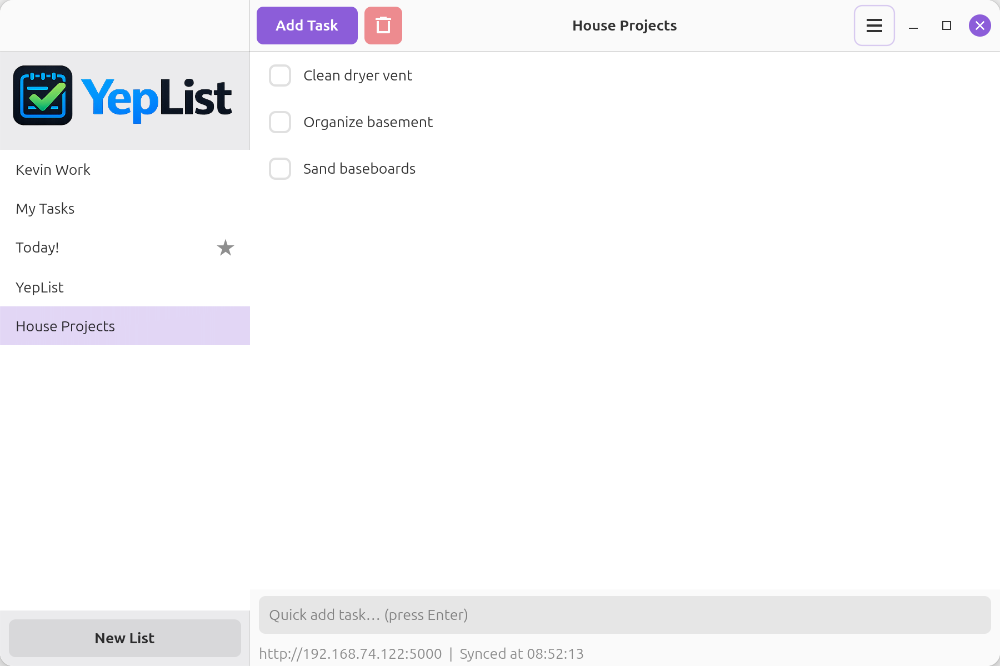
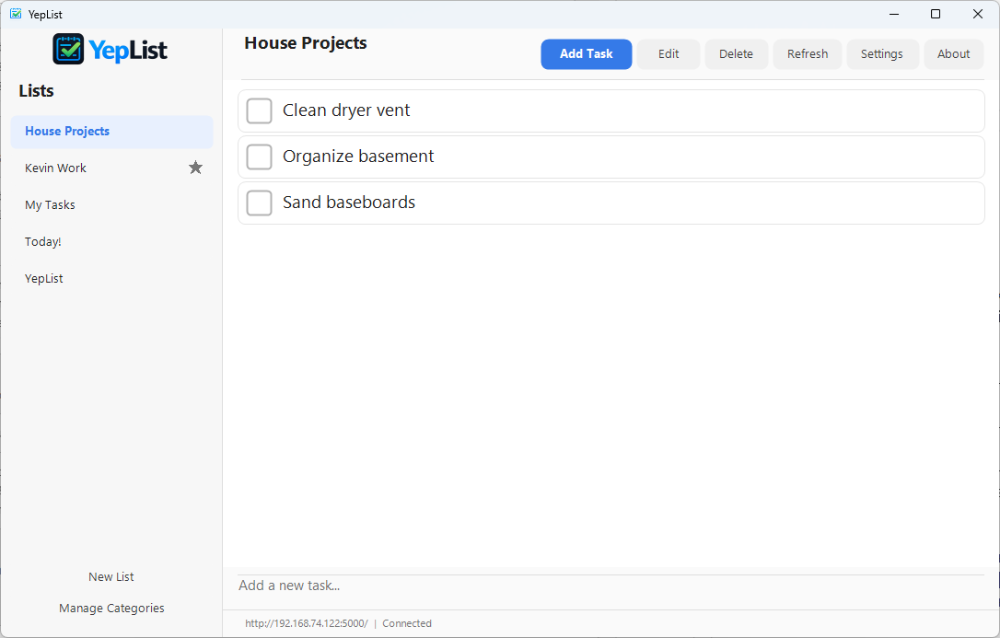
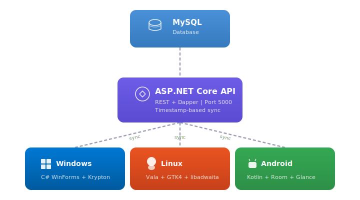

# YepList

> [!WARNING]
> This is very early beta code, use at your own risk. Data is not encrypted in the database and SSL is not forced. Intended for local network traffic only. Don't store any top secret data in this app.

A selfhosted cross-platform (Windows/Linux/Android) To-Do list app. The backend consists of MySQL and C#/ASP.NET Core. Clients are available for Linux, Windows, and Android. 

Created with the help of Generative AI.

## Screenshots
**Linux**



**Windows**


**Android**

screenshot coming soon

## Architecture

YepList uses a shared REST API backend with three native clients that sync via timestamp-based polling.

<p align="center">
  
</p>

## Technology Stack

| Component | Technology |
|-----------|-----------|
| Backend API | ASP.NET Core 10 + Dapper |
| Database | MySQL 8.0 |
| Windows Client | C# WinForms + Krypton Toolkit |
| Linux Client | Vala + GTK4 + libadwaita |
| Android Client | Kotlin + Retrofit + Room + Jetpack Glance |

## Features

- Create and manage multiple task lists
- Organize tasks with color-coded categories
- Set due dates on tasks
- Drag-and-drop task reordering
- Multi-select and bulk delete
- Quick-add task bar
- Cross-platform sync (changes appear on all clients within seconds)
- Android home screen widget with tap-to-complete and delete
- Offline support on Android (local-first with sync queue)
- Dark mode support on all platforms
- Default list setting per client

## Getting Started

### Prerequisites

- **Backend**: .NET 10 SDK, MySQL 8.0
- **Windows Client**: .NET 10 SDK (Windows)
- **Linux Client**: Vala compiler, GTK4, libadwaita, libsoup-3.0, json-glib-1.0, Meson, Ninja
- **Android Client**: Android Studio with JDK 21+

### Server Setup

1. Install MySQL 8.0 and .NET 10 runtime on your Linux server
2. Run the database schema:
   ```bash
   mysql -u root -p < backend/src/ToDoList.Data/Schema/init.sql
   ```
3. Update the connection string in `backend/src/ToDoList.Api/appsettings.json`
4. Publish and deploy the API:
   ```bash
   cd backend
   dotnet publish src/ToDoList.Api -c Release -o publish
   ```
5. The API listens on `http://0.0.0.0:5000` by default

### Building the Clients

**Windows:**
```bash
cd clients/windows
dotnet build src/ToDoList.Windows
```

**Linux:**
```bash
cd clients/linux
meson setup builddir
cd builddir
ninja
./yep-list --server http://your-server:5000
```

**Android:**
```bash
cd clients/android
./gradlew assembleDebug
# APK at app/build/outputs/apk/debug/app-debug.apk
```

## Documentation

See the [full documentation](docs/GUIDE.md) for detailed information on the data model, API reference, sync strategy, client architecture, deployment, and more.

## Project Structure

```
ToDoList/
  backend/
    ToDoList.sln
    src/
      ToDoList.Core/       # Models, DTOs, interfaces
      ToDoList.Data/       # Dapper repositories, DB schema
      ToDoList.Api/        # ASP.NET Core Web API
  clients/
    windows/               # C# WinForms + Krypton
    linux/                 # Vala + GTK4 + libadwaita
    android/               # Kotlin + Retrofit + Room
  resources/               # Logos and icons
  docs/                    # Documentation
```

## License

This project is licensed under the [MIT License](LICENSE).
