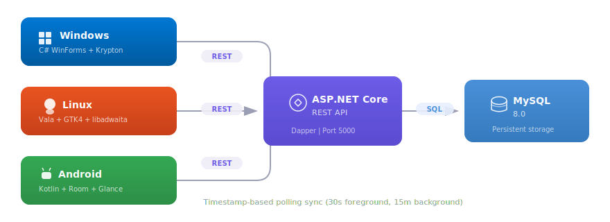

# YepList Documentation

## Table of Contents

- [Architecture Overview](#architecture-overview)
- [Data Model](#data-model)
- [REST API Reference](#rest-api-reference)
- [Backend Structure](#backend-structure)
- [Sync Strategy](#sync-strategy)
- [Windows Client](#windows-client)
- [Linux Client](#linux-client)
- [Android Client](#android-client)
- [Deployment](#deployment)
- [Database Setup](#database-setup)

---

## Architecture Overview

YepList is a cross-platform task management application with a shared REST API backend and three native clients.

<p align="center">
  
</p>

### Technology Stack

| Component | Technology | Purpose |
|-----------|-----------|---------|
| Backend API | ASP.NET Core 10 + Dapper | REST API, data access |
| Database | MySQL 8.0 | Persistent storage |
| Windows Client | C# WinForms + Krypton Toolkit | Desktop app with modern UI |
| Linux Client | Vala + GTK4 + libadwaita | Native GNOME desktop app |
| Android Client | Kotlin + Retrofit + Glance | Mobile app with home widgets |

### Key Design Decisions

- **Dapper over EF Core** -- lightweight, explicit SQL, easy to debug
- **MySQL** -- handles concurrent client connections, runs natively on Ubuntu
- **Timestamp-based sync** -- simple polling vs. WebSocket complexity
- **No auth in v1** -- personal app on home network
- **Separate solutions** -- backend deploys to Linux, Windows client is Windows-only

---

## Data Model

### Entities

**todo_list**
| Column | Type | Notes |
|--------|------|-------|
| list_id | BIGINT (PK) | Auto-increment |
| name | VARCHAR(200) | |
| sort_order | INT | |
| created_date | DATETIME | Auto-set |
| modified_date | DATETIME | Auto-updated by MySQL |

**category**
| Column | Type | Notes |
|--------|------|-------|
| category_id | BIGINT (PK) | Auto-increment |
| name | VARCHAR(100) | |
| color | VARCHAR(7) | Hex color, e.g. `#FF5733` |
| created_date | DATETIME | Auto-set |
| modified_date | DATETIME | Auto-updated by MySQL |

**todo_item**
| Column | Type | Notes |
|--------|------|-------|
| item_id | BIGINT (PK) | Auto-increment |
| list_id | BIGINT (FK) | References todo_list, CASCADE delete |
| category_id | BIGINT (FK) | References category, SET NULL on delete |
| title | VARCHAR(500) | |
| notes | TEXT | |
| is_completed | TINYINT(1) | |
| due_date | DATE | Nullable |
| sort_order | INT | |
| created_date | DATETIME | Auto-set |
| modified_date | DATETIME | Auto-updated by MySQL |

**deleted_entity**
| Column | Type | Notes |
|--------|------|-------|
| id | BIGINT (PK) | Auto-increment |
| entity_type | VARCHAR(50) | `TodoItem`, `TodoList`, `Category` |
| entity_id | BIGINT | ID of the deleted entity |
| deleted_date | DATETIME | |

### Relationships

- **TodoList -> TodoItem**: One-to-many. Deleting a list cascades to all its items.
- **Category -> TodoItem**: One-to-many (nullable). Deleting a category sets items' category to NULL.
- **DeletedEntity**: Tracks deletions for sync. Clients use this to remove deleted items locally.

### Key Column: modified_date

MySQL's `ON UPDATE CURRENT_TIMESTAMP` automatically updates this on every row change. This column drives the entire sync mechanism.

---

## REST API Reference

Base URL: `http://<server>:5000/api`

### Lists

| Method | Path | Body | Response |
|--------|------|------|----------|
| GET | `/api/lists` | -- | TodoListDto[] |
| GET | `/api/lists/{id}` | -- | TodoListDto |
| POST | `/api/lists` | `{ name, sortOrder }` | 201 + TodoListDto |
| PUT | `/api/lists/{id}` | `{ name, sortOrder }` | TodoListDto |
| DELETE | `/api/lists/{id}` | -- | 204 |

### Categories

| Method | Path | Body | Response |
|--------|------|------|----------|
| GET | `/api/categories` | -- | CategoryDto[] |
| GET | `/api/categories/{id}` | -- | CategoryDto |
| POST | `/api/categories` | `{ name, color }` | 201 + CategoryDto |
| PUT | `/api/categories/{id}` | `{ name, color }` | CategoryDto |
| DELETE | `/api/categories/{id}` | -- | 204 |

### Items

| Method | Path | Body | Response |
|--------|------|------|----------|
| GET | `/api/lists/{listId}/items` | -- | TodoItemDto[] |
| GET | `/api/items/{id}` | -- | TodoItemDto |
| POST | `/api/lists/{listId}/items` | `{ title, notes, categoryId, dueDate, sortOrder }` | 201 + TodoItemDto |
| PUT | `/api/items/{id}` | `{ title, notes, categoryId, isCompleted, dueDate, sortOrder }` | TodoItemDto |
| PATCH | `/api/items/{id}/complete` | `{ isCompleted }` | TodoItemDto |
| DELETE | `/api/items/{id}` | -- | 204 |

### Sync

| Method | Path | Query Params | Response |
|--------|------|-------------|----------|
| GET | `/api/sync` | `?since=2026-04-11T10:00:00Z` | SyncResponseDto |

**SyncResponseDto:**
```json
{
  "serverTime": "2026-04-11T12:00:00Z",
  "lists": [ ... ],
  "categories": [ ... ],
  "items": [ ... ],
  "deletedItemIds": [5, 12],
  "deletedListIds": [],
  "deletedCategoryIds": []
}
```

### Debug Logging

| Method | Path | Body | Response |
|--------|------|------|----------|
| POST | `/api/debug/log` | `{ level, tag, message, device, timestamp }` | 200 |
| POST | `/api/debug/log/batch` | Array of log entries | 200 |

---

## Backend Structure

```
backend/
  ToDoList.sln
  src/
    ToDoList.Core/            # Models, DTOs, interfaces (no dependencies)
      Models/
        TodoItem.cs, TodoList.cs, Category.cs, DeletedEntity.cs
      Dtos/
        TodoItemDto.cs, TodoListDto.cs, CategoryDto.cs
        SyncResponseDto.cs
        Create/Update request DTOs
      Interfaces/
        IDbConnectionFactory.cs
    ToDoList.Data/             # Dapper + MySqlConnector
      DbConnectionFactory.cs
      Schema/
        init.sql
      Repositories/
        TodoListRepository.cs, TodoItemRepository.cs
        CategoryRepository.cs, DeletedEntityRepository.cs
    ToDoList.Api/              # ASP.NET Core Web API
      Program.cs
      appsettings.json
      Controllers/
        TodoListsController.cs, TodoItemsController.cs
        CategoriesController.cs, SyncController.cs
        DebugController.cs
      wwwroot/docs/
        index.html
```

### NuGet Packages

| Project | Package | Purpose |
|---------|---------|---------|
| ToDoList.Data | Dapper | Micro-ORM for data access |
| ToDoList.Data | MySqlConnector | Async MySQL driver |
| ToDoList.Data | Microsoft.Extensions.Configuration.Abstractions | IConfiguration interface |

---

## Sync Strategy

### How It Works

1. Every entity has a `modified_date` column auto-updated by MySQL on each write.
2. Each client stores a `lastSyncTime` (initialized to epoch zero on first run).
3. On sync, the client calls `GET /api/sync?since={lastSyncTime}`.
4. The server returns all entities modified since that time, plus deleted entity IDs.
5. The client applies changes to its local state and updates `lastSyncTime` to `serverTime`.

### Polling Intervals

| Client | Interval | Mechanism |
|--------|----------|-----------|
| Windows | 30 seconds | `System.Windows.Forms.Timer` |
| Linux | 30 seconds | `GLib.Timeout.add_seconds` |
| Android (foreground) | Configurable (default 30s) | Coroutine delay loop |
| Android (background) | 15 minutes | WorkManager |

### Conflict Resolution

**Last write wins.** The server is always authoritative. If two clients edit the same task, the last PUT to reach the server wins.

### Deletion Tracking

When the server deletes an entity, it inserts a row into `deleted_entity`. The sync endpoint queries this table and returns deleted IDs to clients. Old records should be purged periodically:

```sql
DELETE FROM deleted_entity WHERE deleted_date < DATE_SUB(NOW(), INTERVAL 30 DAY);
```

---

## Windows Client

A .NET 10 WinForms application using the Krypton Toolkit for a modern themed UI.

### UI Layout

- **Left panel**: KryptonTreeView with list names
- **Right panel**: KryptonDataGridView with columns: checkbox, Title, Category, Due Date
- **Toolbar**: Add, Edit, Delete Task, Refresh
- **Status bar**: Last sync time, connection status

### Key Components

| File | Purpose |
|------|---------|
| `Forms/MainForm.cs` | Main window: list tree + task grid, toolbar, sync timer |
| `Forms/TaskEditForm.cs` | Modal dialog for creating/editing tasks |
| `Forms/ListManagerForm.cs` | Modal dialog for CRUD on lists |
| `Forms/CategoryManagerForm.cs` | Modal dialog for CRUD on categories |
| `Forms/AboutForm.cs` | About dialog |
| `ApiClient/TodoApiClient.cs` | HttpClient wrapper for all API calls |
| `Debug/RemoteLogger.cs` | Remote debug logging to server |
| `Models/` | POCOs mirroring the API DTOs |

### Features

- Dark mode support with auto-detection and theme restart
- Multi-select delete
- Drag-and-drop task reordering
- Quick-add task bar
- Context menus for list management (rename, delete, set default)
- Remote error logging

### Build

```bash
cd clients/windows
dotnet build src/ToDoList.Windows
dotnet run --project src/ToDoList.Windows
```

NuGet: `Krypton.Toolkit` | Target: `net10.0-windows`

---

## Linux Client

A native GNOME application using GTK4 and libadwaita for a modern Linux desktop experience.

### UI Layout

- **Sidebar**: `Gtk.ListView` with lists (via `Adw.NavigationSplitView`)
- **Content**: `Gtk.ListView` with `TaskRow` custom widgets
- **Header bar**: Add Task, Categories menu, Refresh, About

### Key Components

| File | Purpose |
|------|---------|
| `src/Application.vala` | Adw.Application subclass, entry point |
| `src/MainWindow.vala` | Main window with split pane layout |
| `src/TaskRow.vala` | Custom widget: checkbox + title + category + due date |
| `src/TaskEditDialog.vala` | Dialog for creating/editing tasks |
| `src/ListSidebar.vala` | Sidebar component with list management |
| `src/CategoryManagerDialog.vala` | Category CRUD dialog |
| `src/ApiClient.vala` | Soup.Session + json-glib HTTP client |
| `src/Models.vala` | GObject model classes |
| `src/RemoteLogger.vala` | Remote debug logging to server |
| `src/Settings.vala` | Local settings (JSON file) |
| `src/AboutDialog.vala` | About dialog |

### Features

- Multi-select delete
- Drag-and-drop task reordering
- Quick-add task bar
- Context menus for list management
- Default list setting
- Remote error logging

### Dark Mode / Theming

The Linux client uses libadwaita, which manages its own stylesheet independently of the system GTK theme.

- **GNOME**: libadwaita reads the color scheme from the freedesktop portal. Dark mode works automatically.
- **XFCE / Other desktops**: The app queries xfconf directly via D-Bus (`org.xfce.Xfconf.GetProperty` for `/Net/ThemeName`). If it contains "dark", `Adw.ColorScheme.FORCE_DARK` is applied.
- The `GTK_THEME` environment variable is also checked as a fallback.

### Build

```bash
cd clients/linux
meson setup builddir
cd builddir
ninja
./yep-list --server http://your-server:5000
```

Dependencies: `gtk4`, `libadwaita-1` (>= 1.4), `libsoup-3.0`, `json-glib-1.0`

---

## Android Client

A native Android app using MVVM, Material Design 3, Retrofit for networking, Room for local storage, and Jetpack Glance for interactive home screen widgets.

### Architecture

- **MVVM** with `ViewModel` + `StateFlow`
- **Local-first**: All reads from Room via Flow, writes to Room first then sync to server
- **Manual DI** via `AppContainer` (no Hilt/Dagger)
- **Offline support**: Pending operations queue with ID remapping

### Key Features

- Drawer-based navigation with list sidebar
- Multi-select with `SelectionTracker` + bulk delete
- Swipe-to-delete with red background animation
- Long-press delete with confirmation dialog
- Drag-and-drop task reordering
- Quick-add task bar
- Default list setting
- Configurable sync interval (15s, 30s, 1min, 5min, 15min)
- Home screen widget (Jetpack Glance)
- Background sync via WorkManager (15-minute interval)
- Offline support with pending operation queue
- Remote debug logging

### Home Screen Widget

The Jetpack Glance widget displays tasks from a user-selected list directly on the home screen.

- **Checkboxes**: Tap to toggle completion
- **Delete button**: Tap the X to delete a task
- **Auto-refresh**: Updated after every sync cycle
- **List selection**: Configured when widget is placed, each widget can show a different list

### Offline Sync

All writes go to Room first (instant UI update), then push to server. If offline, changes queue in `pending_operations` and push when connectivity returns.

**Write path:**
1. Generate a temporary negative ID for creates
2. Write to Room immediately (UI updates via Flow)
3. Insert a `PendingOperationEntity` into the queue
4. If online, trigger push; if offline, queue handles it later

**Sync cycle (Mutex-protected):**
1. Push phase: process pending operations FIFO
2. Pull phase: `GET /api/sync?since={lastSyncTime}`, upsert all entities
3. Widget update: refresh all home screen widgets

### Key Dependencies

| Library | Purpose |
|---------|---------|
| Retrofit 2 + Gson | REST API client |
| OkHttp 4 | HTTP transport + logging |
| Room | Local SQLite database |
| Kotlin Coroutines | Async operations |
| Jetpack Glance | Home screen widgets |
| WorkManager | Background sync |
| Material Design 3 | UI components |

### Build

```bash
cd clients/android
# Using build.bat (Windows, sets correct JDK):
build.bat
# Or directly:
./gradlew assembleDebug
```

APK output: `app/build/outputs/apk/debug/app-debug.apk`

Min SDK: 26 (Android 8.0) | Target SDK: 35

---

## Deployment

### First-Time Server Setup

```bash
# On a fresh Ubuntu server:
chmod +x scripts/provision-server.sh
sudo ./scripts/provision-server.sh

# Run the database schema:
mysql -u root -p < backend/src/ToDoList.Data/Schema/init.sql
```

### Deploy API

```bash
./scripts/deploy.sh api
```

This will:
1. Publish the API in Release mode
2. Package as tar.gz
3. SCP to the server
4. Stop the systemd service
5. Extract, preserving `appsettings.Production.json`
6. Start the service and verify it's running

### Deploy Linux Client

```bash
./scripts/deploy.sh linux
```

Syncs source to the dev server, builds with meson/ninja, and installs to `/usr/local/bin/yep-list`.

### Check Status

```bash
./scripts/deploy.sh status
```

### Run SQL Migration

```bash
./scripts/deploy.sh sql path/to/migration.sql
```

---

## Database Setup

### Connection String

```
Server=localhost;Database=yeplist;User=yepapp;Password=changeme;SslMode=None
```

### Schema Script

Located at: `backend/src/ToDoList.Data/Schema/init.sql`

Creates:
- `yeplist` database
- `yepapp` MySQL user
- `todo_list`, `category`, `todo_item`, `deleted_entity` tables
- Seed data: "My Tasks" default list

> **Important:** Update the default password in `init.sql` and `appsettings.json` before deploying. Use `appsettings.Production.json` on the server for real credentials.

### Maintenance

The `deleted_entity` table grows over time. Purge old records periodically:

```sql
DELETE FROM deleted_entity WHERE deleted_date < DATE_SUB(NOW(), INTERVAL 30 DAY);
```
